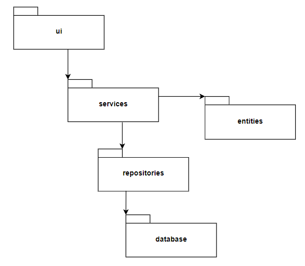

# Arkkitehtuurikuvaus

## Rakenne
Ohjelma noudattaa pitkälti kolmitasoista kerrosarkkitehtuuria. Tämä näkyy src-kansion sisältämän koodin hakemistorakenteesta, jossa ovat seuraavat sovelluksen toimintaan liittyvät kansiot (tässä kuvattuna tasoina):
 1. ui
 2. services, entities
 3. repositories, database

Hakemistoista ui sisältää graafisesta käyttöliittymästä vastaavan koodin, services sovelluslogiikasta vastaavan koodin, entities sovelluksen selkeistä luokista (User) vastaavan koodin ja repositories tietokannasta ja tiedon tallennuksesta vastaavan koodin. Lisäksi hakemisto database sisältää tietokannan alustamiseen liittyvän koodin.

Alla oleva kaavio hahmottaa sovelluksen pakkausrakennetta paremmin.

## Käyttöliittymä
Sovelluksen graafinen käyttöliittymä voidaan jakaa viiteen eri ikkunaan (aloitus-, kirjautumis-, käyttäjän luonti-, portfolio- ja kuvaajaikkuna), joista jokaisesta vastaa oma QDialogin perivä luokka. Ikkunat on liitetty yhteen QStackedWidget-luokalla, joka luodaan tiedostossa gui.py. Tämän luokan avulla pystytään vaihtamaan sovelluksen näyttämää ikkunaa saumattomasti. 

Alla oleva kaavio hahmottaa käyttöliittymäikkunoiden välistä toimintaa.

## Sovelluslogiikka
Alla oleva luokkakaavio havainnollistaa sovelluksen luokkien välisiä suhteita.

Käytännössä kuitenkin sovelluksen logiikka etenee pitkälti graafisen käyttöliittymän ja siten sovelluksen käyttäjän johdolla eli sovellus toimii pitkälti käyttäjän työkaluna.

## Tiedon tallennus
Sovelluksen tiedon tallennuksesta vastaavat repositories-hakemiston sisältämien tiedostojen luokat UserRepository ja StockRepository. Näistä UserRepository vastaa käyttäjätietojen tallentamisesta SQLite-tietokannan tauluun users ja StockRepository osakkeisiin liittyvien tietojen tallentamisesta saman tietokannan tauluun stocks.

## Toiminnallisuuksia
Alla olevassa sekvenssikaaviossa on esitetty käyttäjän sisäänkirjautumisen eteneminen.

## Arkkitehtuurin heikkoudet
Tulossa pian...
