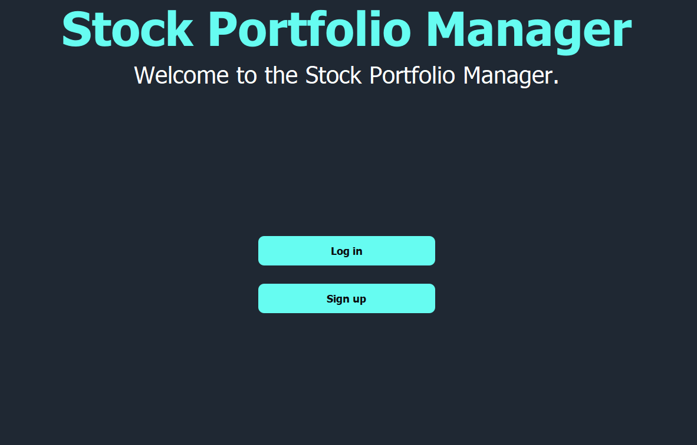
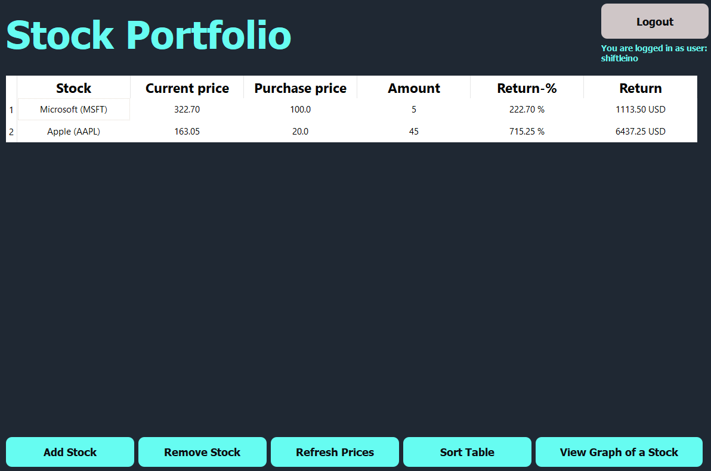

# Instructions
First download the latest release for example as a zip-file from [releases](https://github.com/shiftleino/stockPortfolio/releases).

## Configuration
To change the name of the database the data is stored, change the value of DB_FILENAME in .env-file.

## Start Up
Before trying to start the application, you need to download the dependencies using the following command (assuming you have Poetry installed).
```console 
poetry install
```
If you don't have Poetry, install it from the following link: [link](https://python-poetry.org/docs/#installation). If you for some reason don't want to install Poetry, you can see the dependencies from the following file: [file](https://github.com/shiftleino/stockPortfolio/blob/main/pyproject.toml). Remember also to add Poetry in the PATH:
```console
source $HOME/.poetry/env
```

Now that you have installed the required dependencies, you can start the application using the following command (with Poetry).
```console
poetry run invoke start
```

If you don't have Poetry, run the file src/index.py in your console.

## Sign Up
You can create a new user by first clicking Sign up in the following window.


Then enter your username and password in the following fields and press "Sign up". The application warns if the username or the password is not valid. 


After this you are being redirected to the login window.

## Log In
After pressing Log in button in the first window or being redirected from sign up, you can log in to you account from the following window by typing your username and password into the corresponding fields.


## Managing Portfolio
After logging in to your account, you are redirected to the "main window" shown below. 


In this window you can add, remove and see stocks in your portfolio. Each stock is being shown as a row in the table. 

### Add a Stock
To add a stock into your portfolio, press "Add Stock" and follow the pop-up windows. Notice that the tickers of the stocks must be in the same format as in the website of YAHOO! Finance (as the application uses Yahoo's data).

### Remove a Stock
To remove a stock from the portfolio, press "Remove a Stock" and enter the ticker of the stock you want to remove.

### Refresh Prices
To refresh the current prices in the table, use button "Refresh Prices". It is important to notice that the prices are being collected from the web and therefore there is a small lag when refreshing the prices depending how many stocks you have in the table (1-3s per stock).

### Sort the Table
To start the table press the "Sort Table" -button, which opens up a pop-up window to select on which column you want to sort the table. The sorting will always be done from the lowest value to the highest.

### Viewing Stock Graph
You can view each stock's historical graph by pressing "View Graph of a Stock". in the pop-up window enter the ticker of the stock you want to view. This opens up a new window which shows the historical graph. The graph is interactive and therefore you can zoom in/out and move in the graph. Press "Return to Portfolio" to return back to the "main window". 

