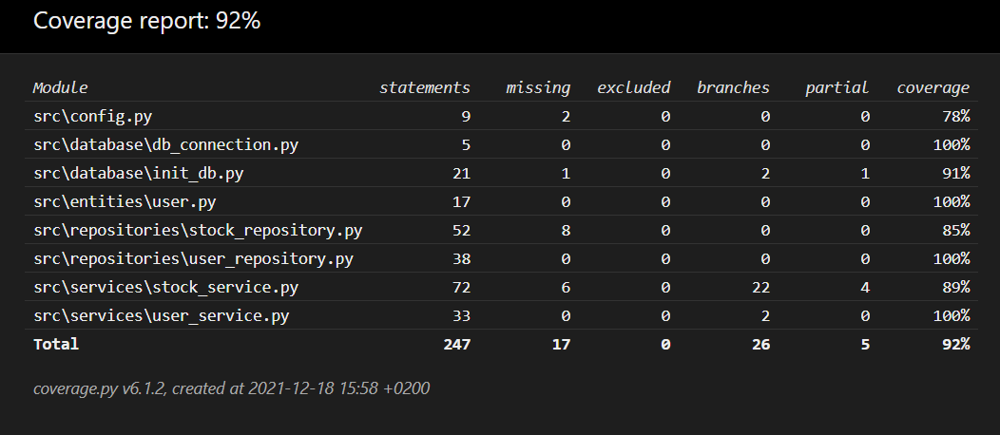

# Testausdokumentti
Sovellus on testattu sekä yksikkö- ja integraatiotesteillä hyödyntäen unittest-kirjastoa että manuaalisesti suorittamalla ohjelmaa. Manuaalinen testaus on toteutettu kokeilemalla jokaista vaatimusmäärittely-dokumentissa esitettyä toiminnallisuutta sekä Windows-laitteella että Linux-laitteella. Lisäksi jokaisessa paikassa, jossa käyttäjän täytyy antaa sovellukseen syötettä, on sovellukseen yritetty syöttää virheellisiä arvoja, kuten esimerkiksi numeroita tekstin sijasta ja tyhjiä syötteitä. Sovellus on läpäissyt kaikki nämä testit.

## Automatisoidut testit
Sovelluksen yksikkö- ja integraatiotestaus on toteutettu automatisoidusti hyödyntämällä unittest-kirjastoa. Testiluokka TestUser vastaa User-luokan toiminnallisuuksien testaamisesta. TestUserRepository ja TestStockRepository luokat taas testaavat Repository-luokkien toimintaa ja ne hyödyntävät tässä omaa tietokantaansa (annettu .env.test-tiedostossa), joka alustetaan aina tyhjäksi ennen jokaista testiä initialize_db -funktiolla.

Testiluokka TestStockService taas testaa StockService luokan toimintaa, joka vastaa pitkälti sovelluksen logiikasta. TestStockService testaa myös samanaikaisesti StockRepository-luokan toimintaa, sillä monet StockService-luokan metodeista hyödyntävät StockRepository-luokkaa. Tällä tavoin päästään testauksessa myös lähemmäs sovelluksen oikeaa toimintaa. 

Testiluokka TestUserService taas testaa UserService luokan toimintaa, joka vastaa käyttäjään liittyvästä sovelluksen toiminnasta. Testiluokka testaa samanaikaisesti myös luokan User toimintaa, sekä myös luokan UserRepository. 

## Testikattavuus
Sovelluksen testauksen haarautumakattavuus (poislukien käyttöliittymästä vastaava koodi) on 92%. Testauksen ulkopuolelle on jäänyt joitain haaraumia StockService ja StockRepository luokissa. Nämä haaraumat ovat pitkälti sqlite3 ja yfinance kirjastojen poikkeustapauksista vastaavia haaraumia, joita on käytännössä mahdotonta testata automatisoiduilla testeillä, sillä niiden tapahtuminen ei esimerkiksi riipu käyttäjän syötteestä. Myös config-tiedostossa ja init_db-tiedostossa on muutama rivi testaamatta, joita ei myöskään ole tarkoituksenmukaista edes testata automatisoiduilla testeillä.

## Virheet ohjelmassa
Ohjelma saattaa joissain tilanteissa käyttäessä Linux-järjestelmää tulostaa terminaaliin seuraavanlaisen virheviestin: 
qt.qpa.xcb: QXcbConnection: XCB error: 3 (BadWindow), sequence: 3798, resource id: 12598715, major code: 40 (TranslateCoords), minor code: 0

Tämä virheviesti ei suoranaisesti johdu sovelluksesta, vaan se on todennäköisesti Qt-ohjelmistoon jäänyt bugi, joka tapahtuu käyttäessä Qt:n Messageboxeja tietyillä järjestelmillä.

Lisää tietoa: 
https://bugreports.qt.io/browse/QTBUG-87141 
https://bugreports.qt.io/browse/QTBUG-56893
